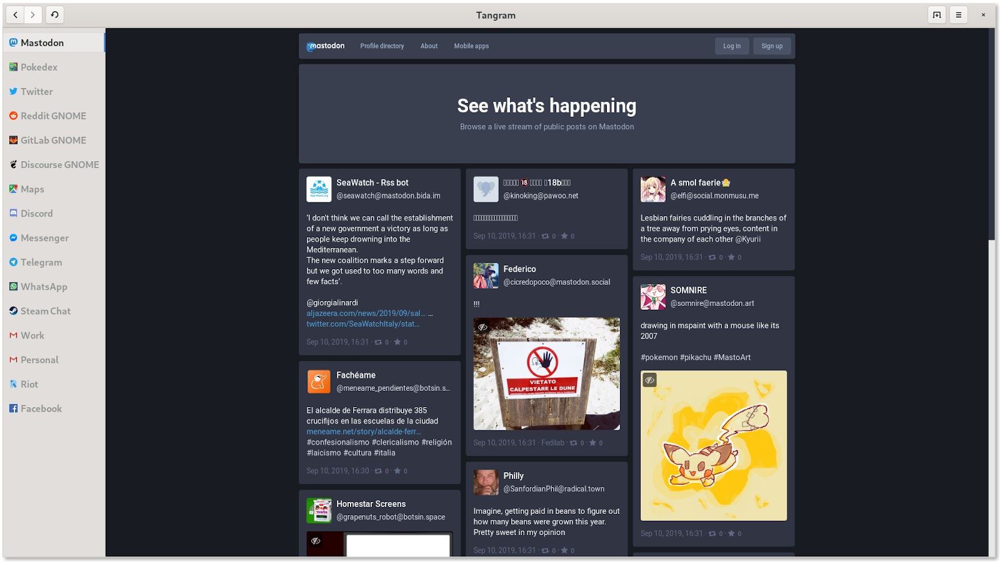

# Tangram

Run web apps on your desktop.

<a href='https://flathub.org/apps/details/re.sonny.Tangram'></a>



## Goal

The goal of the project is to improve integration of web applications into the desktop, specifically [GNOME](https://www.gnome.org/).

## About

Each tab is a container so you can setup web apps with different accounts/settings.

Tangram is powered by [WebKitGTK](https://webkitgtk.org/).

## Features

- Setup and manage web applications
  <!-- - Custom icon -->
- Persistent and independant tabs
- Custom title
- Re-order tabs
- Change tabs position
- Navigation
- Shortcuts
- Persistent desktop notifications

## Roadmap

- Custom icon (almost done)
- Custom applications (almost done)
- Expose WebKitGTK settings (todo)
- SearchProvider (todo)
- Custom CSS/JS for better integration (todo)

<!-- Disabled for now, enable with TANGRAM_ENABLE_CUSTOM_APPLICATIONS=true -->
<!-- use at your own risk -->
<!--
### Custom applications

You can create custom applications with one or multiple tabs. They work the same as the main instance.

See demo: https://www.youtube.com/watch?v=y9MIXn4Iw70

You can create a custom application by

- dragging the tab out (see demo)
- right click on the tab
- via the application menu -->

## Install

[Flatpak](https://flathub.org/apps/details/re.sonny.Tangram)

[Arch Linux](https://aur.archlinux.org/packages/gigagram-git/)

## Details

Similar to [GNOME Web standalone](https://fedoramagazine.org/standalone-web-applications-gnome-web/):

- WebKit data is stored under `~/.local/share/Tangram/{instance-id}/`
- WebKit cache is stored under `~/.cache/Tangram/{instance-id}/`

## Development

### Install dependencies

<details>
 <summary>Ubuntu</summary>
 <code>
 sudo apt install npm libglib2.0-dev-bin flatpak-builder
 </code>
</details>

<details>
 <summary>Arch Linux</summary>
 <code>
 sudo pacman -S npm glib2 flatpak-builder
 </code>
</details>

<details>
  <summary>Fedora</summary>
  <code>
  sudo dnf install npm glib2-devel flatpak-builder
  </code>
</details>

```sh
# Development dependencies
npm install
```

### Run

```sh
./run.sh
```

Hit `<Ctrl><Shift>Q` to restart the application.

- data files are stored in `./var/data/` instead of `$XDG_DATA_HOME/Tangram/`
- cache files are tored in `./var/cache/` instead of `XDG_CACHE_HOME/Tangram/`
- desktop files are stored in `./var/applications/` instead of `$XDG_DATA_HOME/applications/`

To test desktop notifications you can add `https://jhmux.codesandbox.io/`.

### Test

```sh
make test
```

### Meson

```sh
meson --reconfigure --prefix $PWD/install build
ninja -C build install
GSETTINGS_SCHEMA_DIR=./install/share/glib-2.0/schemas/ ./install/bin/re.sonny.Tangram
```

### Flatpak

```sh
flatpak-builder --user --force-clean --install-deps-from=flathub flatpak re.sonny.Tangram.json
flatpak-builder --run flatpak re.sonny.Tangram.json re.sonny.Tangram
```

### Flatpak sandboxed

```sh
flatpak-builder --repo=repo --force-clean flatpak re.sonny.Tangram.json
flatpak --user remote-add --no-gpg-verify Tangram repo
flatpak --user install Tangram re.sonny.Tangram
flatpak run re.sonny.Tangram
```

### Inspect

```sh
gsettings set org.gtk.Settings.Debug enable-inspector-keybinding true
GTK_DEBUG=interactive ./run.sh
```

## Credits

Inspired by [GNOME Web](https://wiki.gnome.org/Apps/Web), [Rambox](https://rambox.pro/#home), [Station](https://getstation.com/) and [Franz](https://meetfranz.com/).
