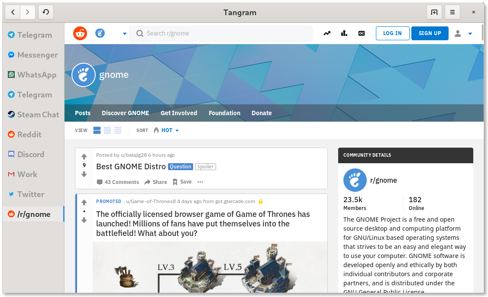

# Gigagram



## Dev

```sh
./run.sh
```

## Inspect

```sh
gsettings set org.gtk.Settings.Debug enable-inspector-keybinding true
GTK_DEBUG=interactive ./run.sh
```

## Test

```sh
npm install
npm test
```

## Meson

```sh
cd gigagram
meson --reconfigure --prefix $PWD/install build
ninja -C build install
./install/bin/re.sonny.gigagram
```

## Flatpak

```sh
cd gigagram
flatpak-builder flatpak re.sonny.gigagram.json
flatpak-builder --run flatpak re.sonny.gigagram.json re.sonny.gigagram
```

## Flatpak sandboxed

```sh
cd gigagram
flatpak-builder --repo=repo --force-clean flatpak re.sonny.gigagram.json
flatpak --user remote-add --no-gpg-verify gigagram-repo repo
flatpak --user install gigagram-repo re.sonny.gigagram
flatpak run re.sonny.gigagram
```
